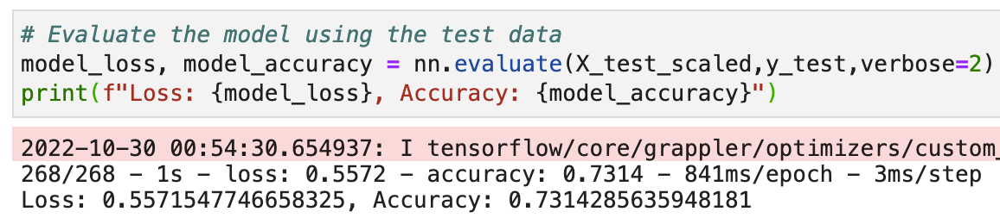

# Neural Network Charity Analysis

# Overview

A non-profit foundation "Alphabet Soup" accepts and approves applications for funding to advance its mission of supporting organizations that focus on environmentalism, population health and well being, and global unification. The foundation has raised and donated over $10 billion in that past 20 years. As a data analyst, I will support the foundation's business team by creating a binary classifier capable of predicting whether funding applicants will be successful in effectively using the funds provided by Alphabet Soup. The end goal of this task will be to streamline the application approval process, while maximizing accuracy in picking successful applicants.

From the business team, I have received a CSV containing more than 34,000 applications that have resulted in many organizations receiving funding from Alphabet Soup over the years. I will preprocess the data and then design, compile, train, and evaluate a deep learning neural network model to predict where the foundation should make investments.

In the dataset are columns capturing metadata about each application, as follows in the data key below.

__Data Key:__
- *EIN and NAME* — Identification columns
- *APPLICATION_TYPE* — Alphabet Soup application type
- *AFFILIATION* — Affiliated sector of industry
- *CLASSIFICATION* — Government organization classification
- *USE_CASE* — Use case for funding
- *ORGANIZATION* — Organization type
- *STATUS* — Active status
- *INCOME_AMT* — Income classification
- *SPECIAL_CONSIDERATIONS* — Special consideration for application
- *ASK_AMT* — Funding amount requested
- *IS_SUCCESSFUL* — Was the money used effectively

Below are the first five rows of the applications dataset contained in the *charity.csv* file.

__Applications DataFrame__

# Results

## Data Preprocessing

- __Target Variable for the Model__
    - The target variable for the binary classification model is found in the "IS_SUCCESSFUL" column. The column is already binarized with "1" representing that the donated funds were successfully used effectively by the recipients and "0" representing that the donated funds were not successfully used effectively. Since we are trying to predict if the funds will be used effectively, or not, we use this column as the target variable for our model. (A sample of the target variable column is displayed below)  
    
- __Feature Variables for the Model__
    - The Feature variables will include all relevant categorical columns. The values of these columns were checked and binned as necessary, and all irrelevant or severely imbalanced columns were removed. This is an iterative process, and the initial model contained a different feature set from the final optimized model. The final remaining categorical feature variables that were used for the (optimized) model are shown below.  
    
- __Other Variables: Neither Targets nor Features__
    - As a part of the Feature Selection process, different variables were dropped for either being non-categorical data, severely imbalanced data, or otherwise unuseful data for classification. Useful categorical features with many unique values were binned after examing the frequency distribition of values for the variables. The intial list of variables (excluding "EIN"), along with their unique value counts, before binning are displayed below.  
     
        - *Binning*: initially only variables with greater than 9 unique values were binned to achieve less than 9 groups per variable. During optimization all variables except for "ASK_AMT" (already optimally binned), were binned in experimentation to maximize model performance. Additionally, the "NAME" column was eliminated in the intial preprocessing and modeling steps, however, was reintroduced during optimization to maximize performance. The "NAME" column was binned with all "NAMES" appearing only once (presumably one-time applicants), binned as "Other". The "NAMES" variable was the only remaining categorical feature with greater than 9 unique values (793) after binning, which was justified based on resulting model performance gains.
    - The "EIN" variable column was dropped from the dataset because it provides a unique identifier to each application with no way to be grouped or aggregated. This makes it an unuseful variable for our model to identify patterns in the data relating to the target output.
    - Another non-categorical variable column, "ASK_AMT", was dropped as it contained ungrouped integer data.
    - Two variables, "SPECIAL_CONSIDERATIONS" and "STATUS", presented extreme imbalance that suggested they were of little use for the model to recognize patterns related to the target output. These variables were removed during model optimization in attempt to maximize model performance. To demonstrate the level of imbalance, the value counts are displayed below.
     
     
        - *Note*: the "STATUS" column was already removed prior to optimization, since the method to remove non-categorical variables as all variables not matching the "object" data type and the "STATUS" data type being an integer. However, during optimization I decided to investigate further as it seems binarized as a categroical column (presumably with "1" representing "active" status and "0" representing "inactive" status - or visa versa). 
    - The data was scaled using the StandardScaler before the training and test split.

## Compiling, Training, and Evaluating the Model

- __Neural Network Design: Neurons, Layers, and Activation Functions__
    - For our predicitve model I decided to use the Keras Sequential model to find relationships in our preprocessed tabular data. For the initial model I chose the model structure as follows:  
        - 43 neurons in the input layer.
            - (same as the number of features in the training set) 
        - 80 neurons in the first hidden layer.
            - (about double the input layer neurons) 
        - 30 neurons in the second hidden layer.
            - (slightly less than half the first hidden layer neurons) 
            - (two hidden layers for deep learning)
        - 1 neuron in the output layer.
            - (matching the number of desired classification outputs for each prediction)
    - I chose the activation functions for the two hidden layers and the output layer as follows:
        - I chose the "ReLU" activation function for the first and second hidden layers.
            - This function helps with processing the complex non-linear relationships in the data, as well as simplifying the output for our binary classifier.
        - I chose the "Sigmoid" activation function for the output layer.
            - This "S-curve" function will help determine the probability values for our ultimate binary classification output, which we also refer to as our predictions for successful donations.
    - The summary and performance of the intial model is displayed below: 
     
    
    
- __Achieving the Target Model Performance__
    - I was able to achieve the target model performance of higher than 75% accuracy. The optimized model was able to reach a model accuracy metric score of 80%. This was a significant improvement over the initial model's 73.1% accuracy. In addition to achieving this target metric, the optimized model shows a lower validation loss metric (47.6%) than the initial model (55.7%) as well.
    - The summary and performance of the optimized model is displayed below: 
     
    
    
- __Optimization Trials: Steps Taken to Increase Model Performance__
    - I first looked to revist preprocessing the data. I elminated all irrelevant data and added more binning to variables as well. Initially, the metrics did not improve. However, after reintroducing and binning the "NAME" variable to the training data, the performance of the model greatly improved. I deduce that the historical performance (or lacktherof) of each organization, in successfully using the donation funding, contained a pattern or measurable relationship to our target variable.
    - After performing new preprocessing on the data I performed 7 different trials of models to find a model design with optimal model performance. Due to introduction of the encoded "NAME" column, the training set feature columns grew to 827 variables. I experimented with neural network designs with more neurons. However, even with the increased width of the training data, increasing the neurons led to a large discrepancy in training and validation loss metrics, suggesting overfitting.
    - The two best performing models in the optimization trials contained fewer neurons in the hidden layers than the input layer. The fourth optimization model (best performance) used 3 hidden layers with 102 neurons in the first, 18, in the second, and 16 in the third. These numbers were reached through a process of trial and error. The sixth optimization model (second best performance) used the same design as the initial model, however, due to changes in the training set the input neurons increased to 827, ceteris paribus.  
    - The summary and performance of the second best optimized model, during the optimization trial process, is displayed below: 
     
     
    - Ultimatley, I chose to save and export the best optimization model as the fourth model over the sixth model. The justification for this is that the model accuracies are nearly identical (the sixth model approximately 0.01% greater), meanwhile, the validation loss was marginally better in the fourth model (the fourth model approximately 0.7% less validation loss).
    - The intial model and the best performing model (fourth optimization model) have both been saved and exported as .h5 files and are located in this repository.

# Summary

__Key Takeaways:__
- Preprocessed the data with combined techniques of feature selection and binning of values based on unique value count and value count frequency distribution. The data was scaled before predictive modeling.
- Compiled, trained, and evaluated the initial model.
- Went through optimization trial process to try multiple model configurations, and iteratively experimented with different data preprocessing steps along with different model designs.
- Met the target of higher than 75% model accuracy, exceeding the target with 80% accuracy performance while reducing validation loss.
    - Reintroducing name column to the dataset for training purposes had the largest positive impact on model performance.
- Saved and exported the intial model, as well as the best optimization model to .h5 files.

__Alternative Model Recommendation__
- An alternative model for our use case would be a Support Vector Machines model (SVMs)
- SVMs excel at binary classification for nonlinear data by calculating geometric hyperplanes to maximize distance between the closest data points between two categories.
- Like neural networks, in binary classification, SVMs will converge on a local minimum to analyze underlying trends in the data. This is useful for constructing effective prediction models, which aligns with our use case.
- SVMs can also be more time and computationally resource efficient, desirably impacting the cost curve of training a model that meets our set target.
